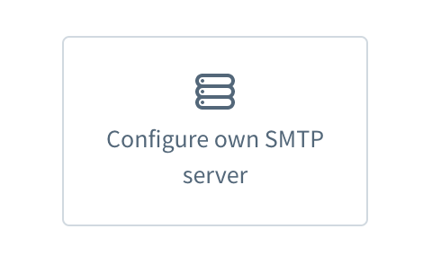
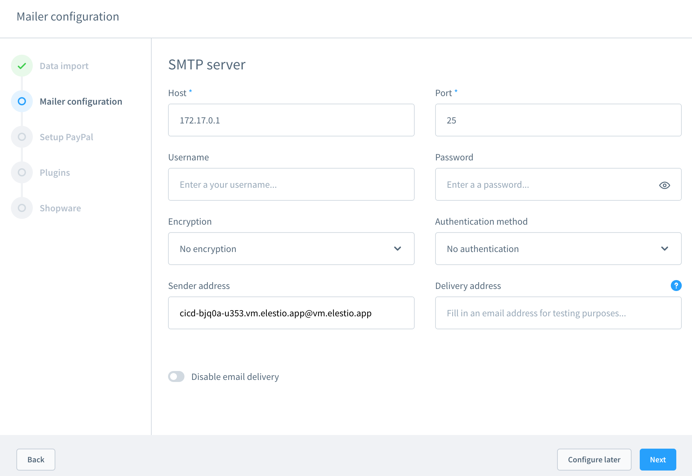

# Shopware 6 CI/CD pipeline

Deploy Shopware 6 server with CI/CD on Elestio

 
 

# Once deployed ...

You can open Shopware 6 UI here:

    URL: https://[CI_CD_DOMAIN]
    Login: root
    password: [ADMIN_PASSWORD]

# Configuring email

Once logged in, a window will open, click on next until you reach the Mailer configuration.

Choose Configure own SMTP server

Fill in the following credentials:

    Host: [EMAIL_HOST]
    Port: [EMAIL_PORT]
    Username and Password must be empty
    Encryption: No encryption
    Authentication method: No authentication
    Sender address: [MAIL_FROM_ADDRESS]

Then Next, complete other configurations if desired.
